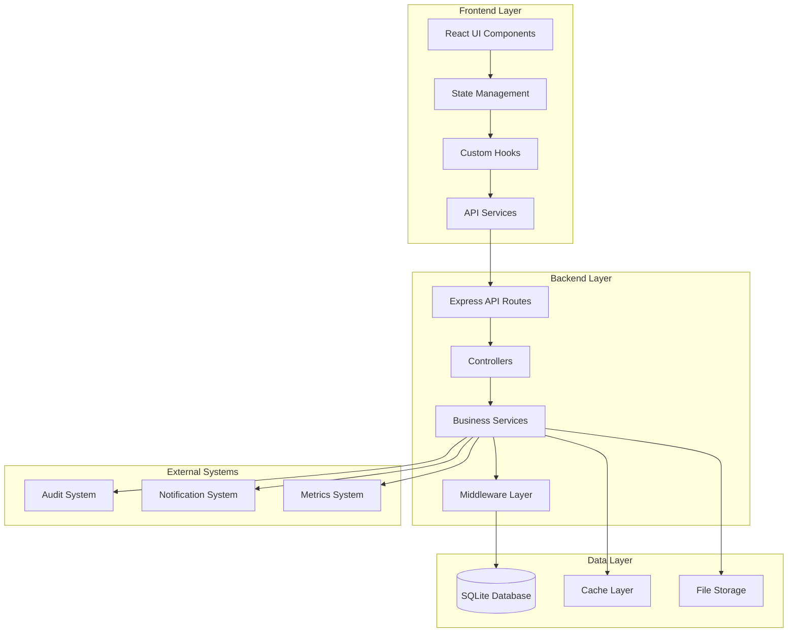
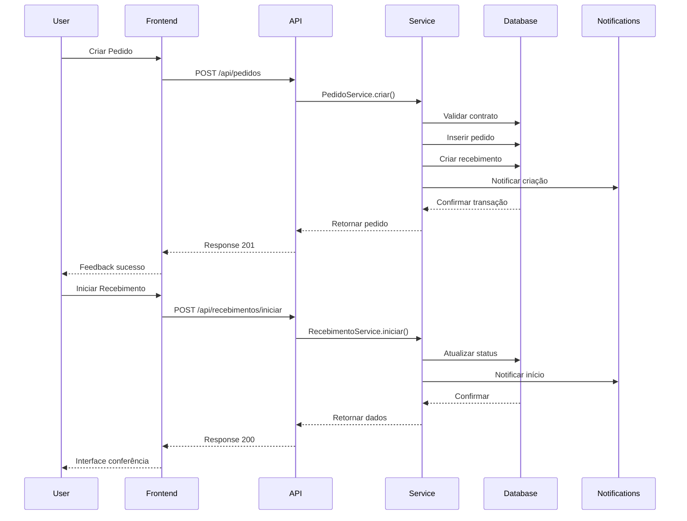

# Design Document

## Overview

Este documento apresenta o design arquitetural para a reformulação completa do módulo de recebimento e pedidos do Sistema de Gerenciamento de Alimentação Escolar. A solução proposta visa criar uma experiência moderna, integrada e eficiente, seguindo as melhores práticas de UX/UI e arquitetura de software.

## Architecture

### High-Level Architecture



### System Flow



## Components and Interfaces

### Frontend Architecture

#### Component Hierarchy

```
PedidosRecebimentosApp/
├── Layout/
│   ├── LayoutModerno.tsx
│   ├── Navigation.tsx
│   └── StatusBar.tsx
├── Pages/
│   ├── PedidosModerno.tsx
│   ├── RecebimentosModerno.tsx
│   ├── PedidoForm.tsx
│   ├── RecebimentoForm.tsx
│   └── Dashboard.tsx
├── Components/
│   ├── PedidoCard.tsx
│   ├── RecebimentoCard.tsx
│   ├── StatusChip.tsx
│   ├── ProgressBar.tsx
│   ├── FilterPanel.tsx
│   ├── SearchBar.tsx
│   ├── ItemConferencia.tsx
│   ├── UploadComprovante.tsx
│   └── AuditTrail.tsx
├── Hooks/
│   ├── usePedidos.ts
│   ├── useRecebimentos.ts
│   ├── useFilters.ts
│   └── useNotifications.ts
└── Services/
    ├── pedidosService.ts
    ├── recebimentosService.ts
    └── apiClient.ts
```

#### Key Components Design

**PedidoCard Component**
```typescript
interface PedidoCardProps {
  pedido: Pedido;
  onVisualizarDetalhes: (pedido: Pedido) => void;
  onIniciarRecebimento: (pedido: Pedido) => void;
  onCancelar: (pedido: Pedido) => void;
}

const PedidoCard: React.FC<PedidoCardProps> = ({
  pedido,
  onVisualizarDetalhes,
  onIniciarRecebimento,
  onCancelar
}) => {
  // Card moderno com hover effects
  // Status visual com chips coloridos
  // Ações contextuais baseadas no status
  // Informações essenciais (fornecedor, valor, data)
  // Progresso visual para recebimentos em andamento
};
```

**RecebimentoForm Component**
```typescript
interface RecebimentoFormProps {
  pedido: Pedido;
  onItemConferido: (item: ItemRecebimento) => void;
  onFinalizarRecebimento: () => void;
  onCancelarItem: (itemId: number) => void;
}

const RecebimentoForm: React.FC<RecebimentoFormProps> = ({
  pedido,
  onItemConferido,
  onFinalizarRecebimento,
  onCancelarItem
}) => {
  // Interface step-by-step para conferência
  // Validação em tempo real
  // Upload de comprovantes
  // Controle de divergências
  // Progresso visual
};
```

#### State Management Strategy

```typescript
// Context para estado global
interface PedidosRecebimentosContextType {
  pedidos: Pedido[];
  recebimentos: Recebimento[];
  filtros: Filtros;
  loading: boolean;
  error: string | null;
  
  // Actions
  carregarPedidos: (filtros?: Filtros) => Promise<void>;
  criarPedido: (dados: CriarPedidoRequest) => Promise<void>;
  iniciarRecebimento: (pedidoId: number) => Promise<void>;
  conferirItem: (dados: ConferirItemRequest) => Promise<void>;
  finalizarRecebimento: (recebimentoId: number) => Promise<void>;
}

// Custom hooks para lógica específica
const usePedidos = () => {
  // Lógica de pedidos
  // Cache local
  // Sincronização com API
};

const useRecebimentos = () => {
  // Lógica de recebimentos
  // Validações
  // Estado de conferência
};
```

### Backend Architecture

#### API Routes Structure

```
/api/v2/
├── pedidos/
│   ├── GET    /                    # Listar pedidos
│   ├── POST   /                    # Criar pedido
│   ├── GET    /:id                 # Obter pedido
│   ├── PUT    /:id                 # Atualizar pedido
│   ├── DELETE /:id                 # Cancelar pedido
│   ├── GET    /:id/produtos        # Produtos do pedido
│   └── POST   /:id/recebimento     # Iniciar recebimento
├── recebimentos/
│   ├── GET    /                    # Listar recebimentos
│   ├── GET    /:id                 # Obter recebimento
│   ├── POST   /:id/itens           # Conferir item
│   ├── PUT    /:id/finalizar       # Finalizar recebimento
│   ├── GET    /:id/historico       # Histórico
│   ├── POST   /:id/comprovantes    # Upload comprovantes
│   └── GET    /:id/auditoria       # Trilha de auditoria
├── dashboard/
│   ├── GET    /metricas            # Métricas gerais
│   ├── GET    /alertas             # Alertas ativos
│   └── GET    /performance         # Indicadores
└── relatorios/
    ├── GET    /pedidos             # Relatório de pedidos
    ├── GET    /recebimentos        # Relatório de recebimentos
    └── GET    /divergencias        # Relatório de divergências
```

#### Service Layer Design

```typescript
// PedidoService - Lógica de negócio para pedidos
class PedidoService {
  static async criarPedido(dados: CriarPedidoRequest): Promise<Pedido> {
    // 1. Validar dados de entrada
    // 2. Verificar saldo do contrato
    // 3. Criar pedido em transação
    // 4. Criar recebimento automático
    // 5. Registrar auditoria
    // 6. Enviar notificações
  }
  
  static async listarPedidos(filtros: PedidoFiltros): Promise<PaginatedResult<Pedido>> {
    // 1. Aplicar filtros
    // 2. Implementar paginação
    // 3. Incluir dados relacionados
    // 4. Calcular estatísticas
  }
  
  static async cancelarPedido(id: number, justificativa: string): Promise<void> {
    // 1. Validar se pode cancelar
    // 2. Estornar saldo do contrato
    // 3. Atualizar status
    // 4. Registrar auditoria
    // 5. Notificar cancelamento
  }
}

// RecebimentoService - Lógica de negócio para recebimentos
class RecebimentoService {
  static async iniciarRecebimento(pedidoId: number): Promise<Recebimento> {
    // 1. Validar pedido
    // 2. Criar/recuperar recebimento
    // 3. Preparar itens para conferência
    // 4. Atualizar status do pedido
    // 5. Registrar início
  }
  
  static async conferirItem(dados: ConferirItemRequest): Promise<void> {
    // 1. Validar dados
    // 2. Verificar quantidades
    // 3. Identificar divergências
    // 4. Registrar conferência
    // 5. Atualizar progresso
    // 6. Notificar se necessário
  }
  
  static async finalizarRecebimento(id: number): Promise<void> {
    // 1. Validar se todos itens foram conferidos
    // 2. Atualizar estoque
    // 3. Finalizar recebimento
    // 4. Atualizar status do pedido
    // 5. Gerar relatório final
  }
}
```

#### Middleware Architecture

```typescript
// Middleware de validação específico
const validarPedido = (req: Request, res: Response, next: NextFunction) => {
  // Validação de schema
  // Sanitização de dados
  // Verificação de permissões
};

const validarRecebimento = (req: Request, res: Response, next: NextFunction) => {
  // Validação de dados de recebimento
  // Verificação de status
  // Controle de acesso
};

// Middleware de auditoria
const auditarOperacao = (operacao: string) => {
  return (req: Request, res: Response, next: NextFunction) => {
    // Capturar dados da requisição
    // Registrar início da operação
    // Interceptar resposta para log completo
  };
};
```

## Data Models

### Enhanced Database Schema

```sql
-- Tabela de pedidos reformulada
CREATE TABLE pedidos_v2 (
  id INTEGER PRIMARY KEY AUTOINCREMENT,
  numero_pedido TEXT NOT NULL UNIQUE,
  fornecedor_id INTEGER NOT NULL,
  contrato_id INTEGER NOT NULL,
  usuario_criacao INTEGER NOT NULL,
  data_pedido DATETIME NOT NULL DEFAULT CURRENT_TIMESTAMP,
  data_entrega_prevista DATETIME,
  status TEXT NOT NULL DEFAULT 'PENDENTE',
  valor_total DECIMAL(10,2) NOT NULL DEFAULT 0,
  observacoes TEXT,
  justificativa_cancelamento TEXT,
  metadata JSON, -- Dados extras flexíveis
  created_at DATETIME NOT NULL DEFAULT CURRENT_TIMESTAMP,
  updated_at DATETIME NOT NULL DEFAULT CURRENT_TIMESTAMP,
  
  FOREIGN KEY (fornecedor_id) REFERENCES fornecedores(id),
  FOREIGN KEY (contrato_id) REFERENCES contratos(id),
  FOREIGN KEY (usuario_criacao) REFERENCES usuarios(id)
);

-- Tabela de itens do pedido
CREATE TABLE pedido_itens_v2 (
  id INTEGER PRIMARY KEY AUTOINCREMENT,
  pedido_id INTEGER NOT NULL,
  produto_id INTEGER NOT NULL,
  quantidade DECIMAL(10,3) NOT NULL,
  preco_unitario DECIMAL(10,2) NOT NULL,
  subtotal DECIMAL(10,2) NOT NULL,
  observacoes TEXT,
  created_at DATETIME NOT NULL DEFAULT CURRENT_TIMESTAMP,
  
  FOREIGN KEY (pedido_id) REFERENCES pedidos_v2(id) ON DELETE CASCADE,
  FOREIGN KEY (produto_id) REFERENCES produtos(id)
);

-- Tabela de recebimentos reformulada
CREATE TABLE recebimentos_v2 (
  id INTEGER PRIMARY KEY AUTOINCREMENT,
  numero_recebimento TEXT NOT NULL UNIQUE,
  pedido_id INTEGER NOT NULL,
  usuario_responsavel INTEGER,
  data_inicio DATETIME,
  data_finalizacao DATETIME,
  status TEXT NOT NULL DEFAULT 'AGUARDANDO',
  progresso_percentual DECIMAL(5,2) DEFAULT 0,
  total_itens INTEGER DEFAULT 0,
  itens_conferidos INTEGER DEFAULT 0,
  tem_divergencias BOOLEAN DEFAULT FALSE,
  observacoes_gerais TEXT,
  metadata JSON,
  created_at DATETIME NOT NULL DEFAULT CURRENT_TIMESTAMP,
  updated_at DATETIME NOT NULL DEFAULT CURRENT_TIMESTAMP,
  
  FOREIGN KEY (pedido_id) REFERENCES pedidos_v2(id),
  FOREIGN KEY (usuario_responsavel) REFERENCES usuarios(id)
);

-- Tabela de itens do recebimento
CREATE TABLE recebimento_itens_v2 (
  id INTEGER PRIMARY KEY AUTOINCREMENT,
  recebimento_id INTEGER NOT NULL,
  produto_id INTEGER NOT NULL,
  quantidade_pedida DECIMAL(10,3) NOT NULL,
  quantidade_recebida DECIMAL(10,3) NOT NULL DEFAULT 0,
  data_validade DATE,
  lote_fornecedor TEXT,
  status_item TEXT NOT NULL DEFAULT 'PENDENTE',
  tem_divergencia BOOLEAN DEFAULT FALSE,
  motivo_divergencia TEXT,
  observacoes TEXT,
  usuario_conferencia INTEGER,
  data_conferencia DATETIME,
  comprovantes JSON, -- Array de URLs dos comprovantes
  created_at DATETIME NOT NULL DEFAULT CURRENT_TIMESTAMP,
  updated_at DATETIME NOT NULL DEFAULT CURRENT_TIMESTAMP,
  
  FOREIGN KEY (recebimento_id) REFERENCES recebimentos_v2(id) ON DELETE CASCADE,
  FOREIGN KEY (produto_id) REFERENCES produtos(id),
  FOREIGN KEY (usuario_conferencia) REFERENCES usuarios(id)
);

-- Tabela de auditoria unificada
CREATE TABLE auditoria_pedidos_recebimentos (
  id INTEGER PRIMARY KEY AUTOINCREMENT,
  entidade_tipo TEXT NOT NULL, -- 'PEDIDO' ou 'RECEBIMENTO'
  entidade_id INTEGER NOT NULL,
  acao TEXT NOT NULL,
  usuario_id INTEGER NOT NULL,
  dados_anteriores JSON,
  dados_novos JSON,
  ip_address TEXT,
  user_agent TEXT,
  observacoes TEXT,
  created_at DATETIME NOT NULL DEFAULT CURRENT_TIMESTAMP,
  
  FOREIGN KEY (usuario_id) REFERENCES usuarios(id)
);

-- Tabela de notificações
CREATE TABLE notificacoes_sistema (
  id INTEGER PRIMARY KEY AUTOINCREMENT,
  usuario_id INTEGER,
  tipo TEXT NOT NULL,
  titulo TEXT NOT NULL,
  mensagem TEXT NOT NULL,
  dados_extras JSON,
  lida BOOLEAN DEFAULT FALSE,
  data_leitura DATETIME,
  created_at DATETIME NOT NULL DEFAULT CURRENT_TIMESTAMP,
  
  FOREIGN KEY (usuario_id) REFERENCES usuarios(id)
);

-- Índices para performance
CREATE INDEX idx_pedidos_v2_status ON pedidos_v2(status);
CREATE INDEX idx_pedidos_v2_fornecedor ON pedidos_v2(fornecedor_id);
CREATE INDEX idx_pedidos_v2_data ON pedidos_v2(data_pedido);
CREATE INDEX idx_recebimentos_v2_status ON recebimentos_v2(status);
CREATE INDEX idx_recebimentos_v2_pedido ON recebimentos_v2(pedido_id);
CREATE INDEX idx_auditoria_entidade ON auditoria_pedidos_recebimentos(entidade_tipo, entidade_id);
CREATE INDEX idx_notificacoes_usuario ON notificacoes_sistema(usuario_id, lida);
```

### TypeScript Interfaces

```typescript
// Interfaces principais
interface Pedido {
  id: number;
  numero_pedido: string;
  fornecedor_id: number;
  contrato_id: number;
  usuario_criacao: number;
  data_pedido: string;
  data_entrega_prevista?: string;
  status: PedidoStatus;
  valor_total: number;
  observacoes?: string;
  justificativa_cancelamento?: string;
  metadata?: Record<string, any>;
  created_at: string;
  updated_at: string;
  
  // Dados relacionados
  fornecedor?: Fornecedor;
  contrato?: Contrato;
  itens?: PedidoItem[];
  recebimento?: Recebimento;
}

interface Recebimento {
  id: number;
  numero_recebimento: string;
  pedido_id: number;
  usuario_responsavel?: number;
  data_inicio?: string;
  data_finalizacao?: string;
  status: RecebimentoStatus;
  progresso_percentual: number;
  total_itens: number;
  itens_conferidos: number;
  tem_divergencias: boolean;
  observacoes_gerais?: string;
  metadata?: Record<string, any>;
  created_at: string;
  updated_at: string;
  
  // Dados relacionados
  pedido?: Pedido;
  itens?: RecebimentoItem[];
  usuario?: Usuario;
}

interface RecebimentoItem {
  id: number;
  recebimento_id: number;
  produto_id: number;
  quantidade_pedida: number;
  quantidade_recebida: number;
  data_validade?: string;
  lote_fornecedor?: string;
  status_item: ItemStatus;
  tem_divergencia: boolean;
  motivo_divergencia?: string;
  observacoes?: string;
  usuario_conferencia?: number;
  data_conferencia?: string;
  comprovantes?: string[];
  created_at: string;
  updated_at: string;
  
  // Dados relacionados
  produto?: Produto;
  usuario?: Usuario;
}

// Enums para status
type PedidoStatus = 
  | 'PENDENTE'
  | 'EM_RECEBIMENTO'
  | 'RECEBIDO_PARCIAL'
  | 'RECEBIDO_TOTAL'
  | 'FINALIZADO'
  | 'FINALIZADO_COM_DIVERGENCIA'
  | 'CANCELADO';

type RecebimentoStatus = 
  | 'AGUARDANDO'
  | 'EM_ANDAMENTO'
  | 'FINALIZADO'
  | 'CANCELADO';

type ItemStatus = 
  | 'PENDENTE'
  | 'CONFERIDO'
  | 'DIVERGENTE'
  | 'CANCELADO';
```

## Error Handling

### Error Classification

```typescript
// Hierarquia de erros customizados
class AppError extends Error {
  public readonly statusCode: number;
  public readonly isOperational: boolean;
  
  constructor(message: string, statusCode: number, isOperational = true) {
    super(message);
    this.statusCode = statusCode;
    this.isOperational = isOperational;
  }
}

class ValidationError extends AppError {
  constructor(message: string, field?: string) {
    super(message, 400);
    this.name = 'ValidationError';
  }
}

class BusinessRuleError extends AppError {
  constructor(message: string) {
    super(message, 422);
    this.name = 'BusinessRuleError';
  }
}

class NotFoundError extends AppError {
  constructor(resource: string) {
    super(`${resource} não encontrado`, 404);
    this.name = 'NotFoundError';
  }
}
```

### Error Handling Strategy

```typescript
// Middleware global de tratamento de erros
const errorHandler = (
  error: Error,
  req: Request,
  res: Response,
  next: NextFunction
) => {
  // Log do erro
  logger.error({
    error: error.message,
    stack: error.stack,
    url: req.url,
    method: req.method,
    ip: req.ip,
    userAgent: req.get('User-Agent')
  });
  
  // Resposta baseada no tipo de erro
  if (error instanceof AppError) {
    return res.status(error.statusCode).json({
      success: false,
      message: error.message,
      type: error.name
    });
  }
  
  // Erro não tratado
  return res.status(500).json({
    success: false,
    message: 'Erro interno do servidor',
    type: 'InternalServerError'
  });
};

// Frontend error boundary
class ErrorBoundary extends React.Component {
  state = { hasError: false, error: null };
  
  static getDerivedStateFromError(error: Error) {
    return { hasError: true, error };
  }
  
  componentDidCatch(error: Error, errorInfo: ErrorInfo) {
    // Log para serviço de monitoramento
    console.error('Error caught by boundary:', error, errorInfo);
  }
  
  render() {
    if (this.state.hasError) {
      return <ErrorFallback error={this.state.error} />;
    }
    
    return this.props.children;
  }
}
```

## Testing Strategy

### Testing Pyramid

```typescript
// Unit Tests - Testes de unidade para services
describe('PedidoService', () => {
  describe('criarPedido', () => {
    it('deve criar pedido com dados válidos', async () => {
      const dados = {
        fornecedor_id: 1,
        contrato_id: 1,
        itens: [{ produto_id: 1, quantidade: 10 }]
      };
      
      const pedido = await PedidoService.criarPedido(dados);
      
      expect(pedido).toBeDefined();
      expect(pedido.status).toBe('PENDENTE');
    });
    
    it('deve rejeitar pedido com saldo insuficiente', async () => {
      const dados = {
        fornecedor_id: 1,
        contrato_id: 1,
        itens: [{ produto_id: 1, quantidade: 1000000 }]
      };
      
      await expect(PedidoService.criarPedido(dados))
        .rejects.toThrow('Saldo insuficiente no contrato');
    });
  });
});

// Integration Tests - Testes de integração para APIs
describe('Pedidos API', () => {
  it('POST /api/pedidos deve criar pedido', async () => {
    const response = await request(app)
      .post('/api/pedidos')
      .send({
        fornecedor_id: 1,
        contrato_id: 1,
        itens: [{ produto_id: 1, quantidade: 10 }]
      })
      .expect(201);
      
    expect(response.body.pedido).toBeDefined();
  });
});

// E2E Tests - Testes end-to-end com Cypress
describe('Fluxo de Pedidos e Recebimentos', () => {
  it('deve permitir criar pedido e processar recebimento', () => {
    cy.visit('/pedidos');
    cy.get('[data-testid="novo-pedido"]').click();
    cy.get('[data-testid="fornecedor-select"]').select('Fornecedor Teste');
    cy.get('[data-testid="adicionar-produto"]').click();
    cy.get('[data-testid="finalizar-pedido"]').click();
    
    cy.get('[data-testid="iniciar-recebimento"]').click();
    cy.get('[data-testid="conferir-item"]').first().click();
    cy.get('[data-testid="quantidade-recebida"]').type('10');
    cy.get('[data-testid="confirmar-item"]').click();
    cy.get('[data-testid="finalizar-recebimento"]').click();
    
    cy.contains('Recebimento finalizado com sucesso');
  });
});
```

### Test Data Management

```typescript
// Factory para dados de teste
class TestDataFactory {
  static criarPedido(overrides = {}) {
    return {
      fornecedor_id: 1,
      contrato_id: 1,
      itens: [
        { produto_id: 1, quantidade: 10, preco_unitario: 5.00 }
      ],
      ...overrides
    };
  }
  
  static criarRecebimento(overrides = {}) {
    return {
      pedido_id: 1,
      itens: [
        { produto_id: 1, quantidade_recebida: 10 }
      ],
      ...overrides
    };
  }
}

// Mocks para testes
const mockDatabase = {
  pedidos: [],
  recebimentos: [],
  
  async findPedido(id: number) {
    return this.pedidos.find(p => p.id === id);
  },
  
  async createPedido(dados: any) {
    const pedido = { id: Date.now(), ...dados };
    this.pedidos.push(pedido);
    return pedido;
  }
};
```

## Performance Considerations

### Frontend Optimizations

```typescript
// Lazy loading de componentes
const PedidoForm = lazy(() => import('./PedidoForm'));
const RecebimentoForm = lazy(() => import('./RecebimentoForm'));

// Memoização de componentes pesados
const PedidoCard = React.memo(({ pedido, onAction }) => {
  // Componente só re-renderiza se pedido mudar
}, (prevProps, nextProps) => {
  return prevProps.pedido.id === nextProps.pedido.id &&
         prevProps.pedido.updated_at === nextProps.pedido.updated_at;
});

// Virtualização para listas grandes
import { FixedSizeList as List } from 'react-window';

const PedidosList = ({ pedidos }) => (
  <List
    height={600}
    itemCount={pedidos.length}
    itemSize={120}
    itemData={pedidos}
  >
    {({ index, style, data }) => (
      <div style={style}>
        <PedidoCard pedido={data[index]} />
      </div>
    )}
  </List>
);

// Cache de dados com React Query
const usePedidos = (filtros) => {
  return useQuery({
    queryKey: ['pedidos', filtros],
    queryFn: () => pedidosService.listar(filtros),
    staleTime: 5 * 60 * 1000, // 5 minutos
    cacheTime: 10 * 60 * 1000, // 10 minutos
  });
};
```

### Backend Optimizations

```typescript
// Connection pooling para database
const dbPool = new Pool({
  max: 20,
  idleTimeoutMillis: 30000,
  connectionTimeoutMillis: 2000,
});

// Cache Redis para dados frequentes
class CacheService {
  static async get(key: string) {
    return await redis.get(key);
  }
  
  static async set(key: string, value: any, ttl = 300) {
    return await redis.setex(key, ttl, JSON.stringify(value));
  }
  
  static async invalidate(pattern: string) {
    const keys = await redis.keys(pattern);
    if (keys.length > 0) {
      await redis.del(...keys);
    }
  }
}

// Paginação eficiente
class PaginationService {
  static async paginate(query: string, params: any[], page: number, limit: number) {
    const offset = (page - 1) * limit;
    
    const [countResult, dataResult] = await Promise.all([
      db.get(`SELECT COUNT(*) as total FROM (${query})`, params),
      db.all(`${query} LIMIT ? OFFSET ?`, [...params, limit, offset])
    ]);
    
    return {
      data: dataResult,
      pagination: {
        page,
        limit,
        total: countResult.total,
        totalPages: Math.ceil(countResult.total / limit),
        hasNext: page * limit < countResult.total,
        hasPrev: page > 1
      }
    };
  }
}

// Otimização de queries com JOINs
const PEDIDOS_WITH_RELATIONS = `
  SELECT 
    p.*,
    f.nome as fornecedor_nome,
    f.cnpj as fornecedor_cnpj,
    c.numero as contrato_numero,
    r.id as recebimento_id,
    r.status as recebimento_status,
    r.progresso_percentual
  FROM pedidos_v2 p
  LEFT JOIN fornecedores f ON p.fornecedor_id = f.id
  LEFT JOIN contratos c ON p.contrato_id = c.id
  LEFT JOIN recebimentos_v2 r ON p.id = r.pedido_id
`;
```

## Security Measures

### Authentication & Authorization

```typescript
// JWT middleware com refresh token
const authenticateToken = (req: Request, res: Response, next: NextFunction) => {
  const authHeader = req.headers['authorization'];
  const token = authHeader && authHeader.split(' ')[1];
  
  if (!token) {
    return res.status(401).json({ message: 'Token de acesso requerido' });
  }
  
  jwt.verify(token, process.env.JWT_SECRET!, (err, user) => {
    if (err) {
      return res.status(403).json({ message: 'Token inválido' });
    }
    req.user = user;
    next();
  });
};

// Autorização baseada em roles
const authorize = (roles: string[]) => {
  return (req: Request, res: Response, next: NextFunction) => {
    const user = req.user as any;
    
    if (!user || !roles.includes(user.role)) {
      return res.status(403).json({ 
        message: 'Acesso negado. Permissões insuficientes.' 
      });
    }
    
    next();
  };
};
```

### Input Validation & Sanitization

```typescript
// Schemas de validação com Joi
const criarPedidoSchema = Joi.object({
  fornecedor_id: Joi.number().integer().positive().required(),
  contrato_id: Joi.number().integer().positive().required(),
  observacoes: Joi.string().max(500).optional(),
  itens: Joi.array().items(
    Joi.object({
      produto_id: Joi.number().integer().positive().required(),
      quantidade: Joi.number().positive().required(),
      preco_unitario: Joi.number().positive().required()
    })
  ).min(1).required()
});

// Middleware de validação
const validateSchema = (schema: Joi.Schema) => {
  return (req: Request, res: Response, next: NextFunction) => {
    const { error, value } = schema.validate(req.body);
    
    if (error) {
      return res.status(400).json({
        message: 'Dados inválidos',
        details: error.details.map(d => d.message)
      });
    }
    
    req.body = value; // Dados sanitizados
    next();
  };
};
```

### Data Protection

```typescript
// Criptografia de dados sensíveis
class EncryptionService {
  private static readonly algorithm = 'aes-256-gcm';
  private static readonly key = crypto.scryptSync(process.env.ENCRYPTION_KEY!, 'salt', 32);
  
  static encrypt(text: string): string {
    const iv = crypto.randomBytes(16);
    const cipher = crypto.createCipher(this.algorithm, this.key);
    cipher.setAAD(Buffer.from('additional-data'));
    
    let encrypted = cipher.update(text, 'utf8', 'hex');
    encrypted += cipher.final('hex');
    
    const authTag = cipher.getAuthTag();
    
    return `${iv.toString('hex')}:${authTag.toString('hex')}:${encrypted}`;
  }
  
  static decrypt(encryptedData: string): string {
    const [ivHex, authTagHex, encrypted] = encryptedData.split(':');
    
    const iv = Buffer.from(ivHex, 'hex');
    const authTag = Buffer.from(authTagHex, 'hex');
    
    const decipher = crypto.createDecipher(this.algorithm, this.key);
    decipher.setAAD(Buffer.from('additional-data'));
    decipher.setAuthTag(authTag);
    
    let decrypted = decipher.update(encrypted, 'hex', 'utf8');
    decrypted += decipher.final('utf8');
    
    return decrypted;
  }
}

// Rate limiting
const rateLimiter = rateLimit({
  windowMs: 15 * 60 * 1000, // 15 minutos
  max: 100, // máximo 100 requests por IP
  message: 'Muitas tentativas. Tente novamente em 15 minutos.',
  standardHeaders: true,
  legacyHeaders: false,
});
```

## Monitoring and Analytics

### Application Monitoring

```typescript
// Health check endpoint
app.get('/health', (req, res) => {
  const healthCheck = {
    uptime: process.uptime(),
    message: 'OK',
    timestamp: Date.now(),
    checks: {
      database: 'OK',
      redis: 'OK',
      fileSystem: 'OK'
    }
  };
  
  res.status(200).json(healthCheck);
});

// Métricas de performance
class MetricsService {
  static async recordPedidoCreated(pedidoId: number, duration: number) {
    await db.run(`
      INSERT INTO metricas_operacoes (
        operacao, entidade_id, duracao_ms, timestamp
      ) VALUES (?, ?, ?, ?)
    `, ['PEDIDO_CREATED', pedidoId, duration, new Date().toISOString()]);
  }
  
  static async recordRecebimentoCompleted(recebimentoId: number, duration: number) {
    await db.run(`
      INSERT INTO metricas_operacoes (
        operacao, entidade_id, duracao_ms, timestamp
      ) VALUES (?, ?, ?, ?)
    `, ['RECEBIMENTO_COMPLETED', recebimentoId, duration, new Date().toISOString()]);
  }
  
  static async getDashboardMetrics() {
    const [pedidosHoje, recebimentosHoje, divergenciasHoje] = await Promise.all([
      db.get(`SELECT COUNT(*) as total FROM pedidos_v2 WHERE DATE(created_at) = DATE('now')`),
      db.get(`SELECT COUNT(*) as total FROM recebimentos_v2 WHERE DATE(updated_at) = DATE('now') AND status = 'FINALIZADO'`),
      db.get(`SELECT COUNT(*) as total FROM recebimento_itens_v2 WHERE tem_divergencia = 1 AND DATE(updated_at) = DATE('now')`)
    ]);
    
    return {
      pedidos_hoje: pedidosHoje.total,
      recebimentos_hoje: recebimentosHoje.total,
      divergencias_hoje: divergenciasHoje.total
    };
  }
}
```

### User Analytics

```typescript
// Tracking de ações do usuário
class AnalyticsService {
  static async trackUserAction(userId: number, action: string, metadata: any) {
    await db.run(`
      INSERT INTO user_analytics (
        usuario_id, acao, metadata, timestamp
      ) VALUES (?, ?, ?, ?)
    `, [userId, action, JSON.stringify(metadata), new Date().toISOString()]);
  }
  
  static async getUserProductivity(userId: number, period: string) {
    const query = `
      SELECT 
        DATE(timestamp) as data,
        COUNT(*) as total_acoes,
        COUNT(CASE WHEN acao = 'PEDIDO_CREATED' THEN 1 END) as pedidos_criados,
        COUNT(CASE WHEN acao = 'RECEBIMENTO_COMPLETED' THEN 1 END) as recebimentos_finalizados
      FROM user_analytics 
      WHERE usuario_id = ? AND timestamp >= datetime('now', ?)
      GROUP BY DATE(timestamp)
      ORDER BY data DESC
    `;
    
    return await db.all(query, [userId, period]);
  }
}
```

Este design document fornece uma base sólida para a implementação da reformulação do módulo de recebimento e pedidos, cobrindo todos os aspectos técnicos necessários para criar uma solução moderna, escalável e confiável.